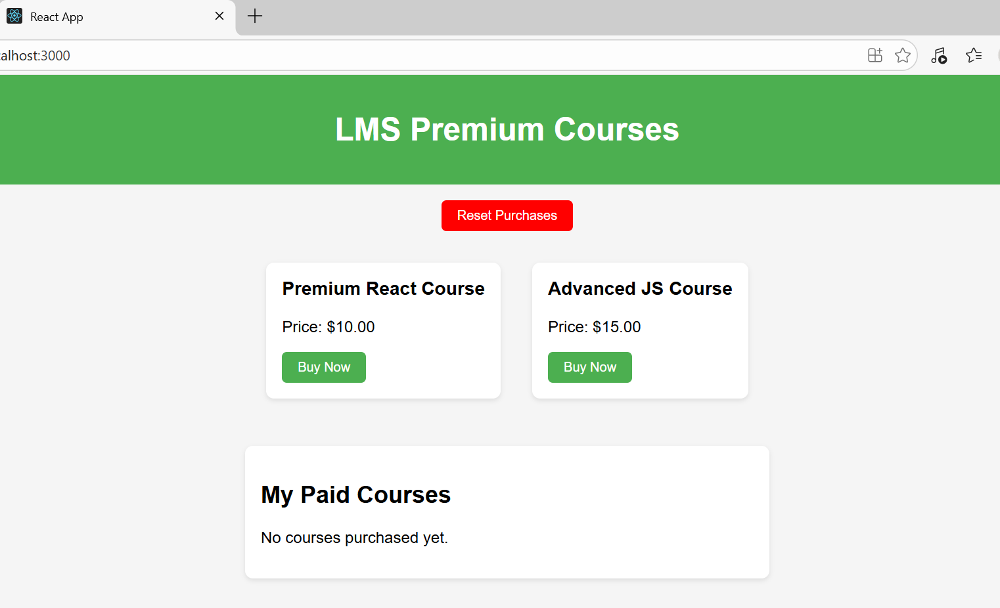
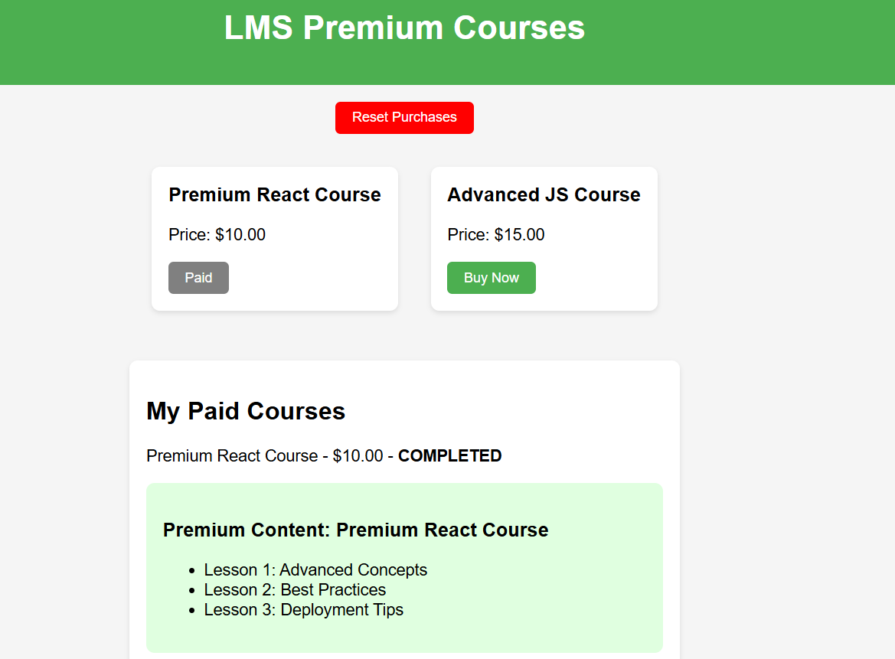
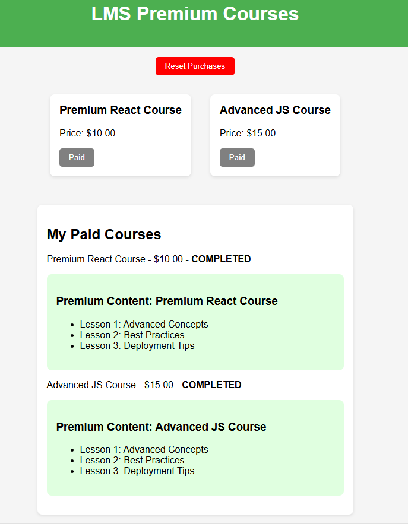

# LMS Payment Project


## Badges


## Overview

This project is a **Learning Management System (LMS)** with **premium course access** via **mock PayPal payment integration**. It demonstrates **frontend-backend interaction**, **access control**, and **payment flow simulation**.

- Frontend: React.js  
- Backend: Node.js + Express.js  
- Payment: Mock PayPal API


## Features

- 💳 **Secure Payment Simulation**: Mock PayPal payment integration.  
- 🔒 **Access Control**: Only paid courses show premium content.  
- 📚 **Multiple Courses**: Supports multiple courses with independent payment.  
- 🎨 **Customizable Styling**: All CSS is in a separate `main.css`.  
- 🔄 **Persistence**: Purchased courses remain visible after page refresh.  
- 🔴 **Reset Purchases**: Reset button for testing without clearing the repo.


## Screenshots









## Installation

### Backend Setup

```bash
cd backend
npm install
npm run dev
````

* Runs the backend server on `http://localhost:5000`.
* Mock payment endpoints:

  * `/api/payment/create`
  * `/api/payment/execute`

### Frontend Setup

```bash
cd frontend
npm install
npm start
```

* Runs the frontend on `http://localhost:3000`.
* Checkout page displays purchased courses.
* Reset Purchases button clears all payments for testing.


## Usage

1. Open the frontend: `http://localhost:3000`.
2. Click **Buy Now** on a course card to simulate payment.
3. Go to **Checkout Page** to see purchased courses and premium content.
4. Refresh page → purchased courses remain visible.
5. Click **Reset Purchases** to clear all payments for testing.


## Folder Structure

```
lms-payment-project/
│
├─ backend/               
│   ├─ controllers/
│   │   └─ paymentController.js
│   ├─ routes/
│   │   └─ payment.js
│   ├─ config/
│   │   └─ paypalConfig.js
│   ├─ package.json
│   └─ server.js
│
├─ frontend/              
│   ├─ public/
│   │   └─ index.html
│   ├─ src/
│   │   ├─ components/
│   │   │   ├─ CourseCard.js
│   │   │   └─ PremiumContent.js
│   │   ├─ pages/
│   │   │   └─ CheckoutPage.js
│   │   ├─ styles/
│   │   │   └─ main.css
│   │   ├─ App.js
│   │   └─ index.js
│   └─ package.json
│
├─ .gitignore
└─ README.md
```


## Future Improvements

* Integrate **real PayPal sandbox/live keys** for actual payment.
* Add **Stripe integration** for payment flexibility.
* Connect to a **database** to persist purchases for multiple users.
* Add **user authentication** and premium course access by user account.


## License

This project is licensed under the MIT License.
